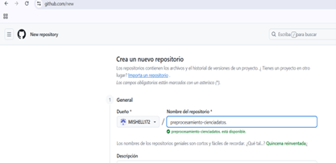
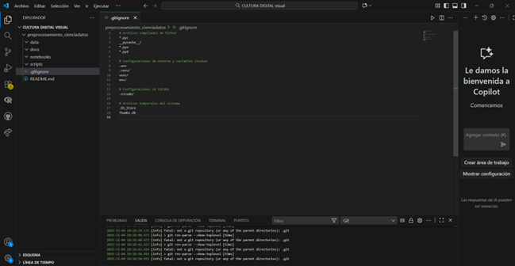
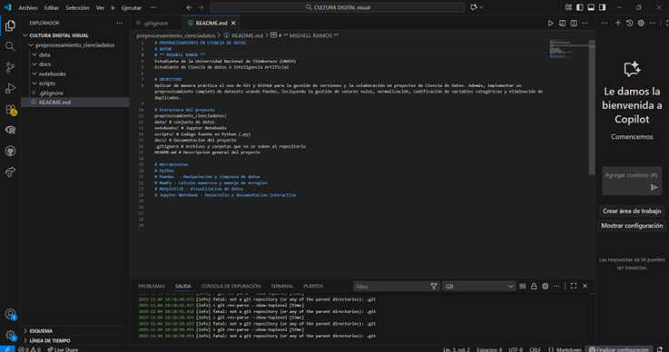
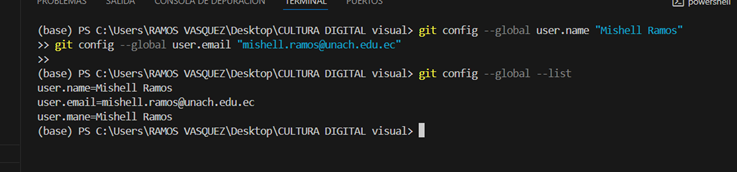
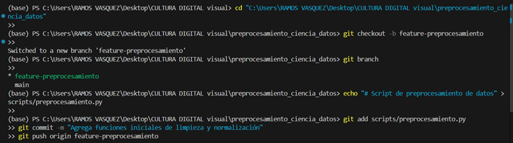
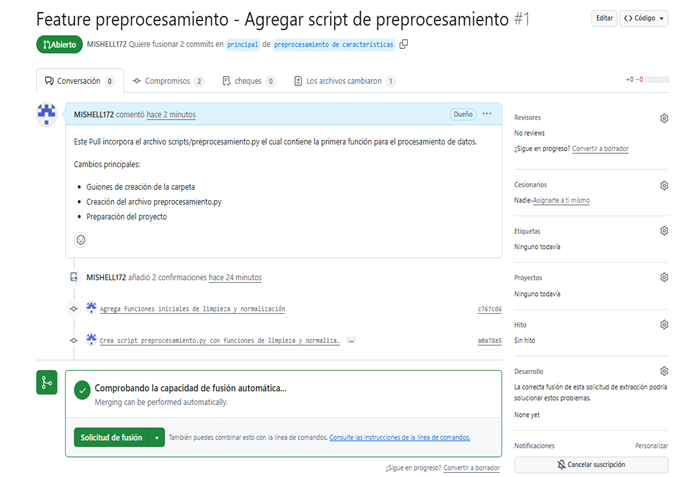
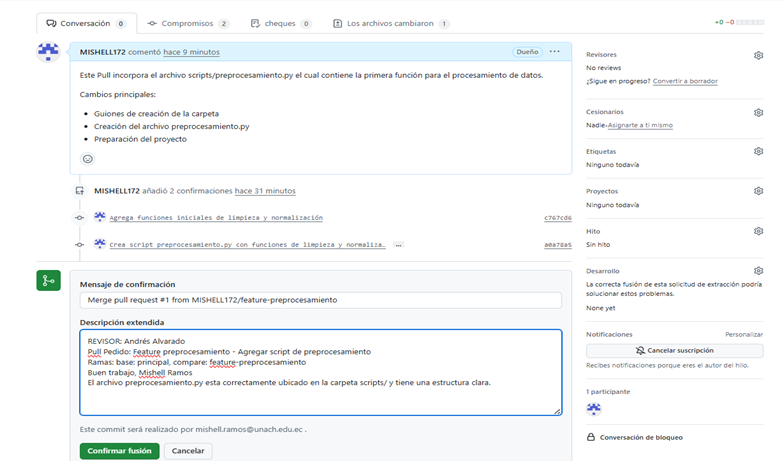
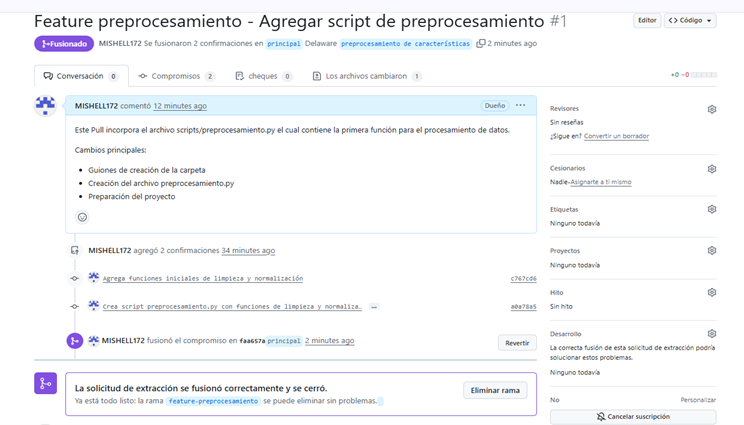

# DOCUMENTACION DEL PROYECTO 
# Preprocesamiento en Ciencia de datos

## Autor 
Mishell Pamela Ramos Vasquez 
## Fecha
09-11-2025
## Carrera
Ciencia de Datos e inteligencia artificial
## Periodo académico
2025
## Semestre
Tercero A

# INTRODUCCION

## OBJECTIVO 
Aplicar de manera práctica el uso de Git y GitHub para la gestión de versiones y la colaboración en proyectos de Ciencia de Datos. Además, implementar un preprocesamiento completo de datasets usando Pandas, incluyendo la gestión de valores nulos, normalización, codificación de variables categóricas y eliminación de duplicados. 

## Estructura del proyecto 
preprocesamiento_cienciadatos/
data/ # conjunto de datos 
notebooks/ # Jupyter Notebooks
scripts/ # Codigo fuente en Python (.py)
docs/ # Documentacion del proyecto 
.gitignore # Archivos y carpetas que no se suben al repositorio 
README.md # Descripcion general del proyecto 

## Comandos GIT usados 
git clone -> clona el repositorio 
git config --global user.name -> Configura el nombre de usuario
git config --global user.email -> configura el correo del usuario 
git checkout -b feature-preprocesamiento -> Crea y cambia a una nueva rama de desarrollo 
git add -> Añade todos los archivos modificados
git commit -m -> guarda los cambios 
git push origin feature-preprocesamiento -> envia la nueva rama y sus comits 
git merge feature-preprocesamiento -> Fusiona los cambios de la rama secundaria 
git branch -d feature-preprocesamiento -> Elimina la rama local
git push origin --delete feature-preprocesamiento -> elimina la rama remota 

## Automatización 

En este proyecto se implemento el workflow  para automatizar la verificacion del codigo Python. Además, el flujo ejecuta automaticamente pruebas y verificar cada vez que se hace un push.

## Captura de pantalla 

### Imagen 1

### Imagen 2

### Imagen 3

### Imagen 4

### Imagen 5

### Imagen 6

### Imagen 7

### Imagen 8

### Imagen 9

